<div align="center">

# HireReady AI - The Interview Studio

**Practise the interview. Hear how you actually sound.**

An AI-powered mock interview platform: generate role-specific questions, answer them on camera, review your take, and get a structured evaluation of what you said and how you said it.


<br />

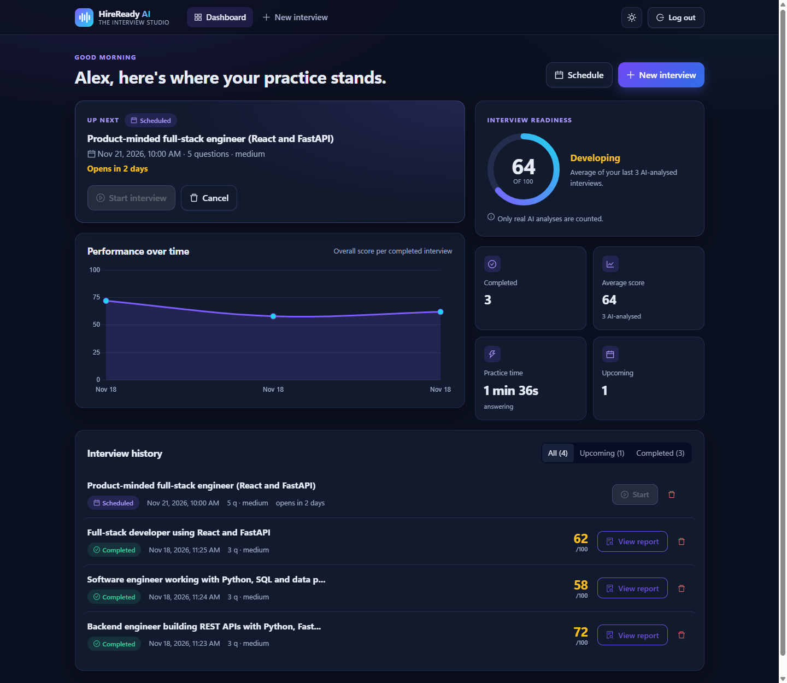

<sub>The dashboard ("command center"). Screenshot of the real application with a fictional account.</sub>

</div>

<br />

**Contents:**
[Overview](#overview) |
[Features](#features) |
[Screenshots](#screenshots) |
[Demo Mode vs Real AI Mode](#demo-mode-vs-real-ai-mode) |
[Tech stack](#tech-stack) |
[Architecture](#architecture) |
[Getting started](#getting-started) |
[Configuration](#configuration) |
[API](#api-reference) |
[Project structure](#project-structure) |
[Testing and verification](#testing-and-verification) |
[Limitations](#limitations) |
[Future work](#future-work) |
[Troubleshooting](#troubleshooting) |
[License](#license-and-credits)

---

## Overview

### The problem

Interview skill is built by doing it out loud, but most candidates practise silently, in their heads. They get no questions tailored to the role, never see themselves answer on camera, and receive no objective feedback on content, delivery or timing.

### The solution

HireReady AI is a self-hosted web application that turns a job description into a complete practice loop:

1. **Set up**: describe the role, choose difficulty and length, then start now or schedule it for later.
2. **Record**: answer each question on camera in a calm interview studio, with a visible timer and question navigator.
3. **Review**: watch your take back, re-record it, or submit it.
4. **Evaluate**: receive a transcript, a score per answer, communication and body-language observations, and an overall report, then track your progress over time.

It is a final-year academic project. It runs entirely on your own machine with **local MongoDB**, **local video storage** and an optional **Google Gemini API key**. Without a key it still works in [Demo Mode](#demo-mode-vs-real-ai-mode).

---

## Features

| Area | What you get |
|---|---|
| **Accounts** | Registration and login with JWT tokens, bcrypt-hashed passwords, inline validation, a live password-strength hint, and automatic logout when a session expires. |
| **Question generation** | Role-specific questions from a job description, at easy / medium / hard difficulty, 1-10 questions. Validated so you always get exactly the number requested. |
| **Scheduling** | Start immediately, or schedule an interview up to a year ahead. The dashboard shows a countdown and unlocks **Start** when the time arrives. |
| **Interview lifecycle** | `scheduled`, `in progress`, `completed` and `missed` statuses. Resume an unfinished interview, or cancel / delete any interview and its recording. |
| **Interview studio** | The current question is the focus. Recording indicator, total and per-answer timers, a question navigator, and a calm layout. Camera permission errors are explained with a retry. |
| **Review before submit** | Play the take back, **re-record**, download a copy, or submit. If an upload fails, the recording stays in the page for **Retry**. Upload progress is the real byte count. |
| **AI evaluation** | Gemini analyses the recording: transcript, per-question score, communication and body-language notes, overall score, key takeaways, strengths and improvement areas. |
| **Evaluation report** | A full-page report with score ring, question-by-question breakdown (expandable), communication analysis, evidence quotes and the recording. |
| **Dashboard** | Personalised welcome, an "Up next" card, interview readiness, summary tiles, a performance chart, and a filterable history with Start / Resume / View report / Delete. |
| **Demo Mode** | Works with no Gemini key, using built-in sample questions and clearly labelled sample feedback. |
| **Privacy** | Recordings are stored locally under random names and are only served to their owner. The temporary copy sent to Gemini is deleted after analysis. |
| **Design and accessibility** | Dark (default) and light themes, responsive from phone to desktop, keyboard-accessible controls, status shown by icon and text (not colour alone), reduced-motion support. |

---

## Screenshots

> **How these were captured.** Every image is a real screenshot of the running application (headless Chrome), using a **fictional account** and sample data. Recordings used a **synthetic camera feed and a text-to-speech voice** instead of a real person, so the AI report below is a genuine Gemini analysis of that synthetic recording: its scores are not representative of a real candidate, and Gemini itself notes that the video is a static avatar. Demo Mode screens are labelled as such.

### Getting in

<table>
  <tr>
    <td colspan="2">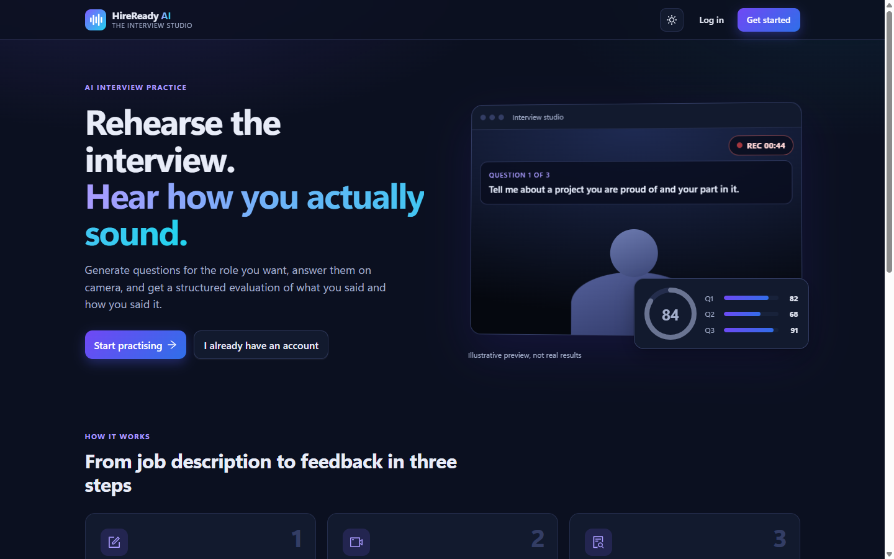<br /><sub><b>Landing page.</b> The studio preview is an illustration with sample content and is labelled as such.</sub></td>
  </tr>
  <tr>
    <td width="50%"><br /><sub><b>Registration</b> with inline validation and a live password-strength hint.</sub></td>
    <td width="50%">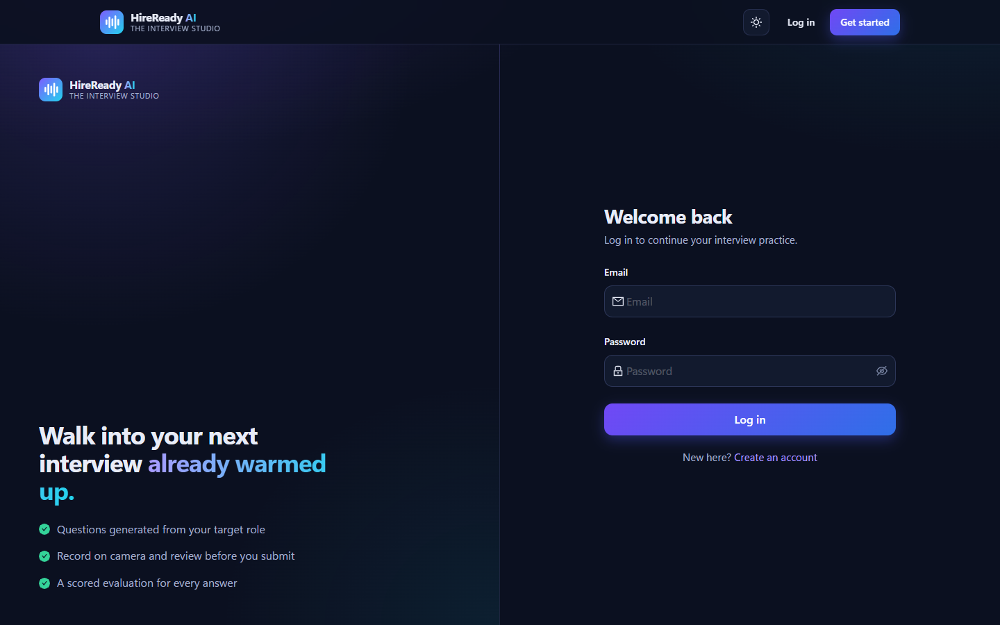<br /><sub><b>Login</b> on the same split layout, with inline error feedback.</sub></td>
  </tr>
</table>

### Set up and schedule

<table>
  <tr>
    <td width="50%">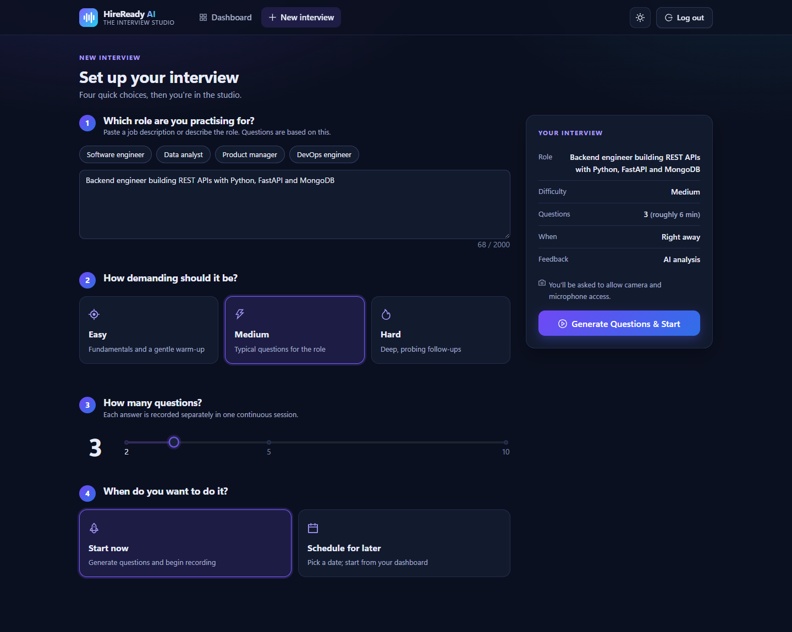<br /><sub><b>Guided setup.</b> Role, difficulty, length and timing, with a live summary panel.</sub></td>
    <td width="50%">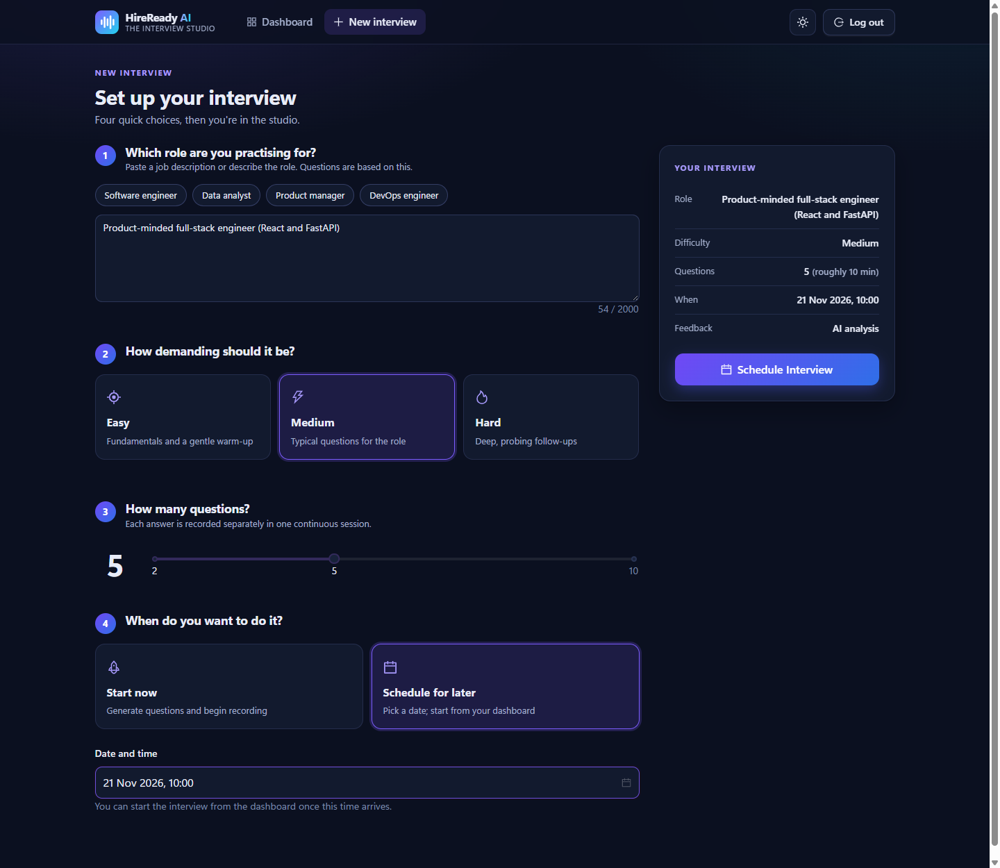<br /><sub><b>Scheduling.</b> Choose "Schedule for later" and pick a date and time; start it from the dashboard when it is due.</sub></td>
  </tr>
</table>

### The interview studio

<table>
  <tr>
    <td width="50%">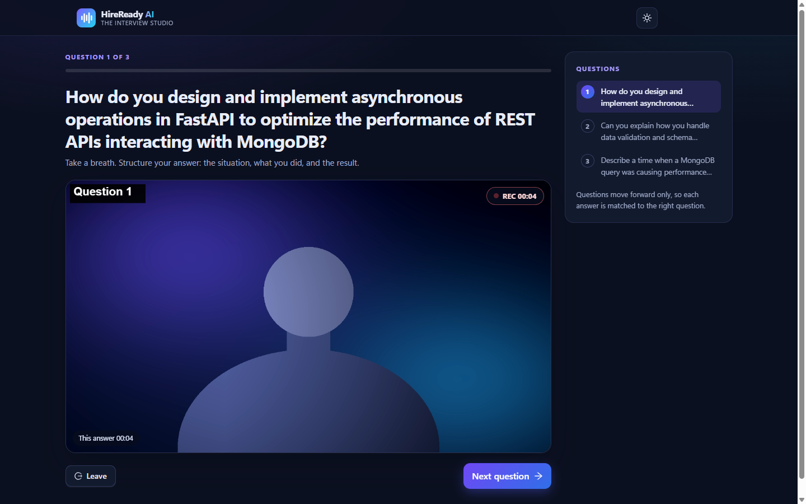<br /><sub><b>Studio.</b> The question is the focus, with a REC badge, total and per-answer timers, and a question navigator.</sub></td>
    <td width="50%">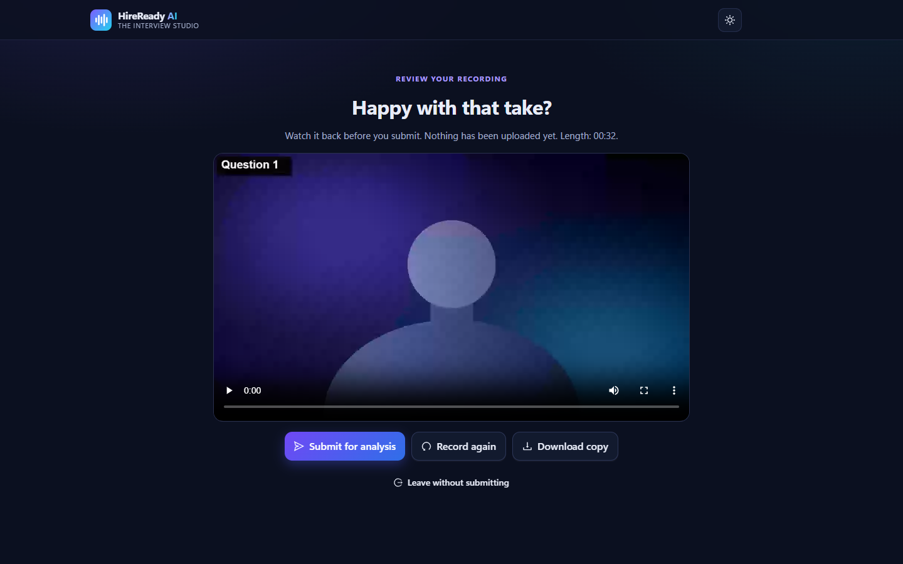<br /><sub><b>Review.</b> Watch the take back before anything is uploaded, then submit, re-record or download a copy.</sub></td>
  </tr>
</table>

### Results

<table>
  <tr>
    <td width="50%">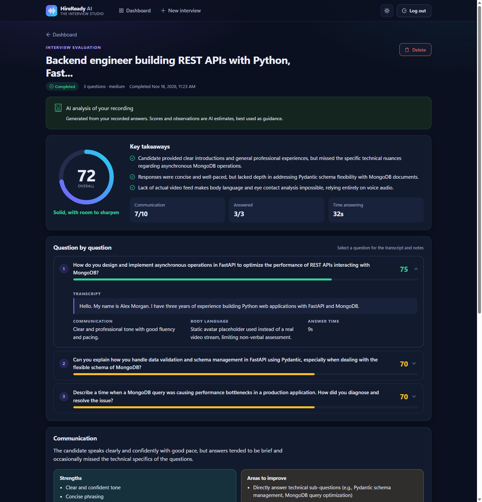<br /><sub><b>AI evaluation report (real Gemini analysis).</b> Overall score, key takeaways and an expandable question-by-question breakdown with transcripts.</sub></td>
    <td width="50%">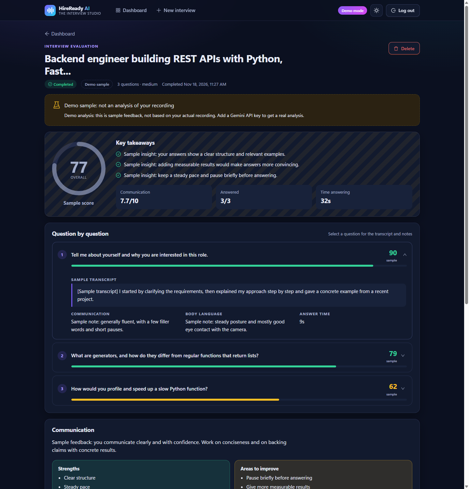<br /><sub><b>Demo Mode report.</b> Marked as a sample: striped summary, a warning banner and "sample" on every score.</sub></td>
  </tr>
</table>

### Themes

<table>
  <tr>
    <td width="50%">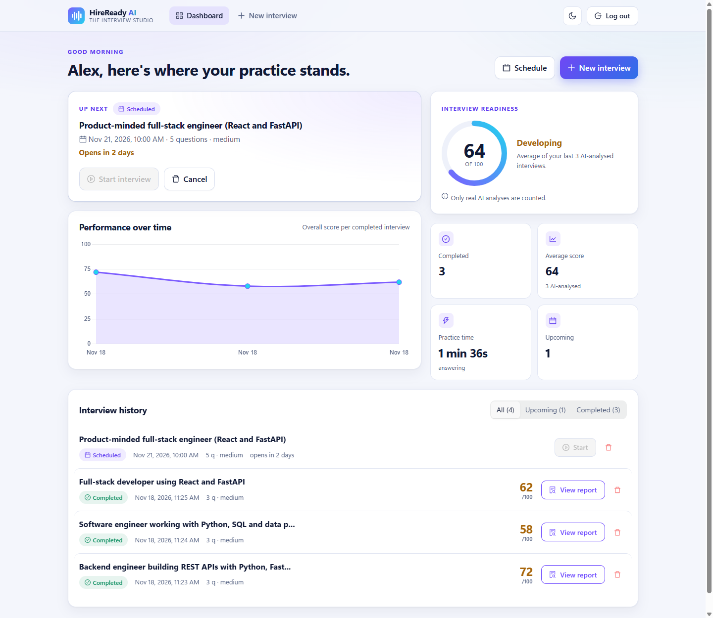<br /><sub><b>Light theme.</b> The same dashboard in the light palette.</sub></td>
    <td width="50%">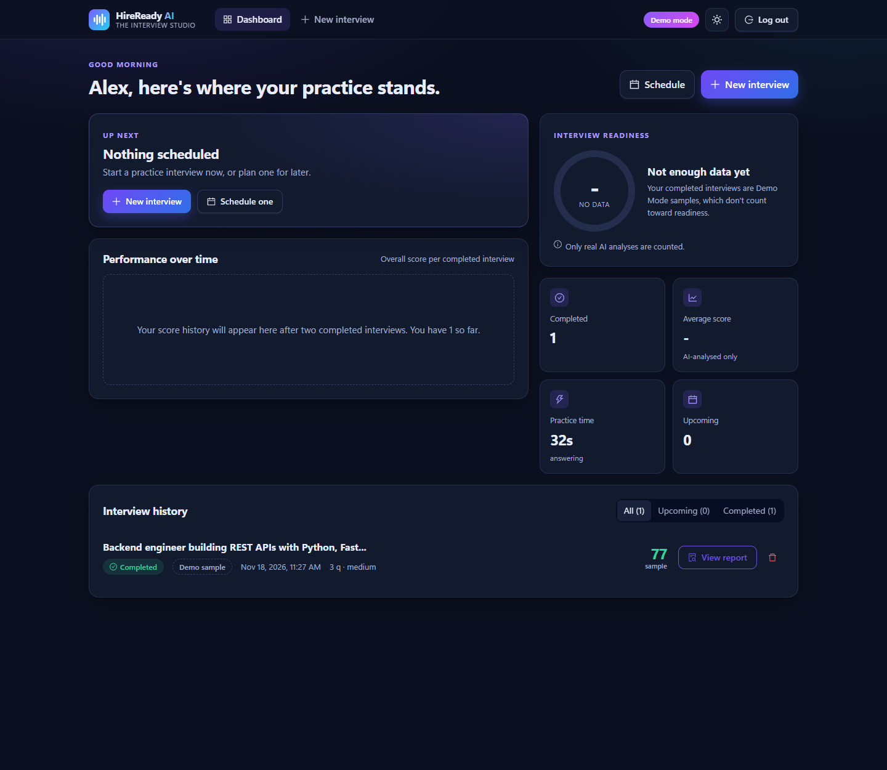<br /><sub><b>Dashboard in Demo Mode.</b> Demo results are tagged and never count toward readiness or averages.</sub></td>
  </tr>
</table>

### Mobile

<table>
  <tr>
    <td width="25%">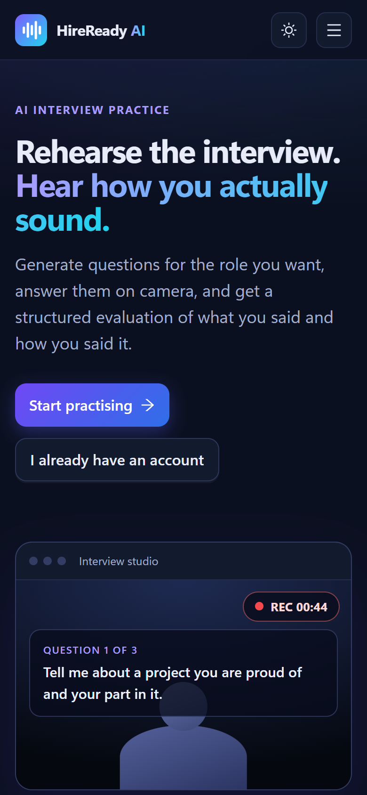<br /><sub>Landing</sub></td>
    <td width="25%">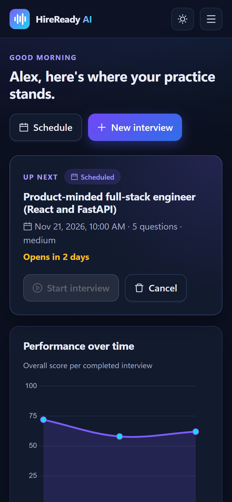<br /><sub>Dashboard</sub></td>
    <td width="25%">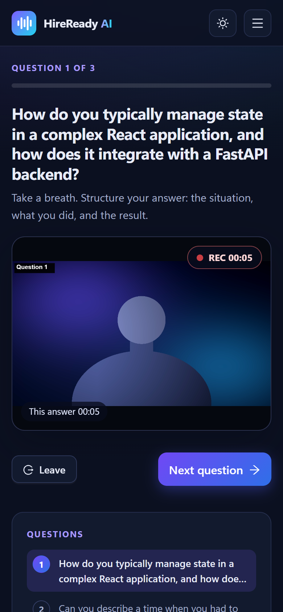<br /><sub>Studio</sub></td>
    <td width="25%">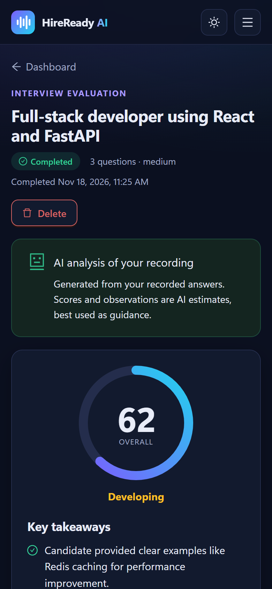<br /><sub>Report</sub></td>
  </tr>
</table>

---

## Demo Mode vs Real AI Mode

The app decides its mode at startup and tells you in the interface.

| | **Real AI Mode** | **Demo Mode** |
|---|---|---|
| **When it is on** | A Gemini API key is configured | `GEMINI_API_KEY` is empty (or the `.env.example` placeholder), or `DEMO_MODE=true` |
| **Questions** | Generated by Gemini from your job description | Chosen from a built-in bank by keywords in the job description (Python, front-end, back-end, data, DevOps, general) |
| **Analysis** | Gemini watches the recording, transcribes it and scores each answer | **Sample data** generated from the questions only. It does not look at the recording |
| **Network** | Calls the Gemini API | No external requests |
| **In the interface** | "AI analysis of your recording" banner | "Demo mode" pill, a "Demo sample" banner and tag, "sample" on every score |
| **Readiness and averages** | Counted | **Never counted** |
| **Recordings** | Validated and stored locally | Validated and stored locally (identically) |

Demo Mode exists so the whole workflow (setup, scheduling, recording, review, upload, report, dashboard) can be explored without an API key. It never presents sample feedback as real analysis.

---

## Tech stack

| Layer | Technology |
|---|---|
| **Frontend** | React 18 (Create React App), React Router 6, Ant Design 5, Chart.js (`react-chartjs-2`), Axios, browser `MediaRecorder` and canvas for recording |
| **Backend** | Python 3.11, FastAPI, Uvicorn, Pydantic v2, PyMongo, python-jose (JWT), passlib + bcrypt |
| **AI** | Google Gemini via the `google-genai` SDK (Gemini API key, Files API for video) |
| **Data** | Local MongoDB (users and sessions), local filesystem (recordings) |

---

## Architecture

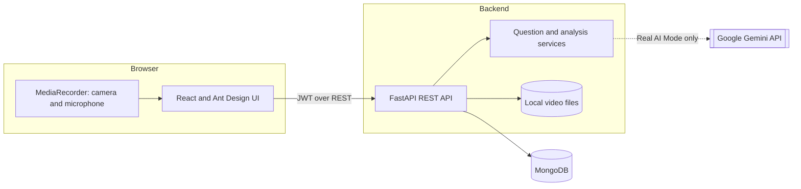
```mermaid
flowchart LR
  subgraph Browser
    UI[React and Ant Design UI]
    REC[MediaRecorder: camera and microphone]
  end
  subgraph Backend
    API[FastAPI REST API]
    SVC[Question and analysis services]
    FS[(Local video files)]
  end
  DB[(MongoDB)]
  G[[Google Gemini API]]
  REC --> UI
  UI -->|JWT over REST| API
  API --> DB
  API --> FS
  API --> SVC
  SVC -.->|Real AI Mode only| G
```

### Workflow

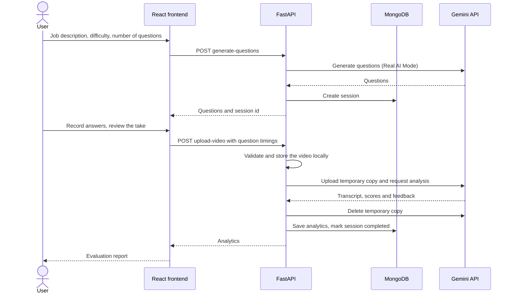
```mermaid
sequenceDiagram
  actor U as User
  participant FE as React frontend
  participant API as FastAPI
  participant DB as MongoDB
  participant G as Gemini API

  U->>FE: Job description, difficulty, number of questions
  FE->>API: POST generate-questions
  API->>G: Generate questions (Real AI Mode)
  G-->>API: Questions
  API->>DB: Create session
  API-->>FE: Questions and session id
  U->>FE: Record answers, review the take
  FE->>API: POST upload-video with question timings
  API->>API: Validate and store the video locally
  API->>G: Upload temporary copy and request analysis
  G-->>API: Transcript, scores and feedback
  API->>G: Delete temporary copy
  API->>DB: Save analytics, mark session completed
  API-->>FE: Analytics
  FE-->>U: Evaluation report
```

In Demo Mode the two Gemini steps are replaced by built-in sample generators.

### Interview lifecycle

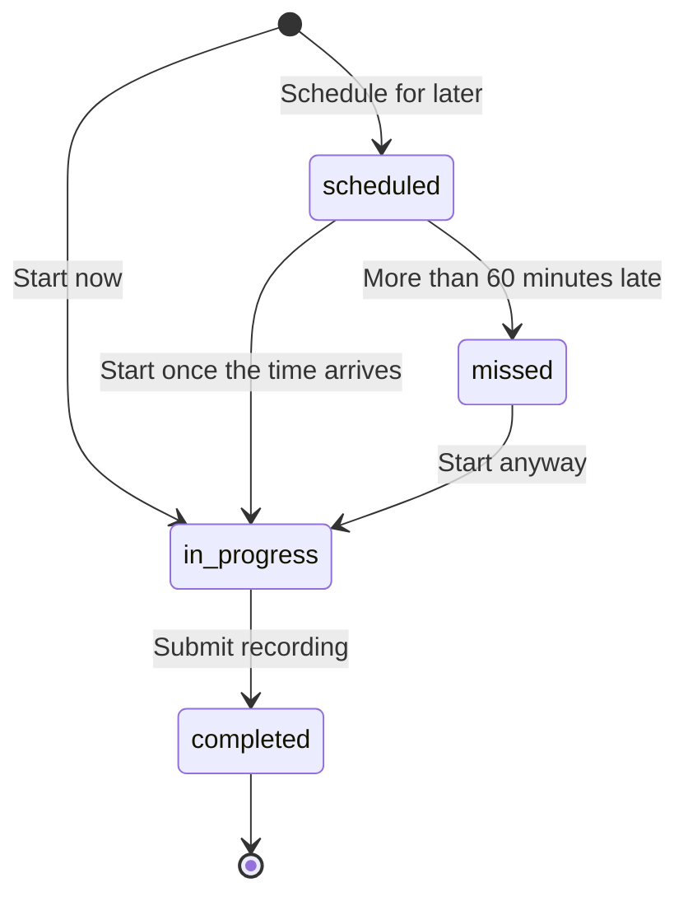
```mermaid
stateDiagram-v2
  [*] --> scheduled: Schedule for later
  [*] --> in_progress: Start now
  scheduled --> in_progress: Start once the time arrives
  scheduled --> missed: More than 60 minutes late
  missed --> in_progress: Start anyway
  in_progress --> completed: Submit recording
  completed --> [*]
```

`missed` is computed when the interview is read, not stored, and a missed interview can still be started. Interviews created before scheduling existed are classified automatically (with analysis: completed, otherwise in progress).

### Data model

| Collection | Main fields |
|---|---|
| `users` | `email` (unique), `password` (bcrypt hash) |
| `sessions` | `user_id`, `job_description`, `difficulty`, `num_questions`, `questions[]`, `status`, `scheduled_at`, `started_at`, `completed_at`, `video_path` (bare file name), `video_mime_type`, `analytics`, `demo` |

Times are stored in UTC and shown in your browser's local time.

### How the real (Gemini) analysis works

1. The browser records camera and microphone into a WebM file (MP4 in Safari) and notes the exact second each question appeared.
2. The backend validates and stores the file locally, uploads a temporary copy to the Gemini Files API, and waits until Gemini has finished processing it.
3. Gemini returns a transcript, a score, and communication and body-language notes per question, plus overall feedback, as JSON. Answers are segmented using the question timings measured by the browser.
4. The result is validated and normalised (scores clamped to 0-100, missing parts defaulted), and the answer times shown are the measured ones, not the model's guesses.
5. The temporary Gemini copy is always deleted, even if the analysis fails. Your local recording is kept.

Transient Gemini problems (HTTP 500/502/503/504, network errors) are retried (up to three attempts in total). Quota errors, a bad key, a retired model or an unreadable video are reported immediately with a specific message. The API key is never written to logs or returned in responses.

---

## Getting started

### Prerequisites

| Requirement | Notes |
|---|---|
| **Python 3.11** | Tested on Python 3.11 only |
| **Node.js 18+** and npm | |
| **MongoDB Community Server** | Running locally |
| **A modern browser** | Chrome, Edge or Firefox, with camera and microphone access. The app must be opened on `localhost` or HTTPS |
| *Optional:* **Gemini API key** | Free tier is enough: <https://aistudio.google.com/apikey>. Not needed for Demo Mode |

### 1. Start MongoDB

**Windows** (PowerShell): install [MongoDB Community Server](https://www.mongodb.com/try/download/community) with "Install as a Service", then check it is running:

```powershell
Get-Service MongoDB          # if not Running: net start MongoDB   (administrator terminal)
```

No service? Run it manually: `mongod --dbpath C:\data\db` (create the folder first).

**macOS / Linux:** install MongoDB Community Server and start it with your package manager (for example `brew services start mongodb-community`, or `sudo systemctl start mongod`).

The backend connects to `mongodb://localhost:27017` by default and creates the database and collections on first use.

### 2. Backend

```powershell
cd backend
python -m venv venv
venv\Scripts\activate                 # macOS/Linux: source venv/bin/activate
pip install -r requirements.txt

copy .env.example .env                # macOS/Linux: cp .env.example .env
# edit .env: at minimum set SECRET_KEY (see Configuration)

uvicorn app.main:app --reload
```

The API runs at <http://localhost:8000>, with interactive docs at <http://localhost:8000/docs>. If configuration is missing, the server stops at startup with a message naming the missing variable; if MongoDB is unreachable, it says so. Secrets and connection strings are never printed.

### 3. Frontend

```powershell
cd frontend
copy .env.example .env                # optional: the default API URL is http://localhost:8000
npm install
npm start
```

Open <http://localhost:3000>.

### 4. Try it

1. Register an account (password of at least 8 characters) and log in.
2. Click **New interview**, describe a role, pick difficulty and length, and choose **Start now** or **Schedule for later**.
3. For *Start now*, allow camera and microphone access, answer each question aloud and click **Next question**. On the last question click **Finish & Submit**.
4. Review the recording, then **Submit**. With Gemini, analysis typically takes under a minute; in Demo Mode it is instant.
5. Your **evaluation report** opens. Find every interview again from the dashboard.

For a scheduled interview, use **Start** in the *Up next* card once the time has arrived. Use **Resume interview** for an unfinished one.

---

## Configuration

### Backend environment variables (`backend/.env`)

Copy `backend/.env.example` to `backend/.env`. Never commit `.env` (it is already in `.gitignore`).

| Variable | Required | Default | Description |
|---|---|---|---|
| `SECRET_KEY` | **yes** | | Long random string used to sign login tokens |
| `GEMINI_API_KEY` | no | | Your Gemini API key. Empty or placeholder means Demo Mode |
| `DEMO_MODE` | no | | Set to `true` to force Demo Mode even when a key is set |
| `MONGODB_URI` | no | `mongodb://localhost:27017` | MongoDB connection string |
| `DATABASE_NAME` | no | `interview_ai` | Database name |
| `LOCAL_VIDEO_DIR` | no | `uploads/interviews` | Where recordings are saved (relative paths are relative to `backend/`) |
| `MAX_VIDEO_SIZE_MB` | no | `100` | Maximum upload size |
| `GEMINI_MODEL` | no | `gemini-flash-lite-latest` | Gemini model used for questions and analysis |

Generate a secret key:

```bash
python -c "import secrets; print(secrets.token_urlsafe(48))"
```

### Frontend environment variable (`frontend/.env`)

| Variable | Default | Description |
|---|---|---|
| `REACT_APP_API_URL` | `http://localhost:8000` | Backend base URL |

### Gemini API configuration

1. Create a key at <https://aistudio.google.com/apikey>.
2. Put it in `backend/.env` as `GEMINI_API_KEY=...` and remove (or leave unset) `DEMO_MODE`.
3. Restart the backend. `GET /config` and the interface (no "Demo mode" pill) confirm Real AI Mode.

**About the model.** `gemini-2.0-flash`, used by the original project, has been retired by Google and now returns a 404. The default is the `gemini-flash-lite-latest` alias, which was the reliably responsive option when tested; larger flash models (for example `gemini-flash-latest`) were overloaded and timing out at that time. Set `GEMINI_MODEL` to try a higher-quality model such as `gemini-3-flash-preview` when your key has capacity.

### Local video storage

- Recordings are saved in `LOCAL_VIDEO_DIR` (default `backend/uploads/interviews/`), created automatically and git-ignored.
- Each file gets a random UUID name and keeps its real format. Allowed types: `video/webm`, `video/mp4`, `video/quicktime`. The content is checked against the declared type and the size limit is enforced while uploading.
- MongoDB stores only the bare file name and MIME type, never a filesystem path.
- There are no public URLs. A recording is returned only to the logged-in owner of the session, and the interface fetches it with the user's token.

---

## API reference

All errors are returned as `{"detail": "message"}`. Interactive documentation is available at `/docs` when the backend is running.

| Method | Path | Auth | Description |
|---|---|---|---|
| GET | `/` | no | Health message |
| GET | `/config` | no | Non-secret settings: `{demo_mode, demo_reason, max_video_size_mb}` |
| POST | `/auth/register` | no | JSON `{email, password}` (password at least 8 characters). 400 if the email exists |
| POST | `/auth/token` | no | Form fields `username` (the email) and `password`. Returns `{access_token, token_type}`. 401 for wrong credentials |
| GET | `/auth/me` | yes | Current user's email |
| POST | `/interview/generate-questions` | yes | JSON `{job_description, difficulty: easy\|medium\|hard, num_questions: 1-10, scheduled_at?}`. Returns `{questions, session_id, status, scheduled_at}` |
| POST | `/interview/sessions/{id}/start` | yes | Start or resume an interview and return its questions. 409 if scheduled for the future or already completed |
| POST | `/interview/upload-video` | yes | Multipart form: `session_id`, `file`, optionally `question_timestamps` (JSON list, seconds from the start of the recording at which each question was shown) and `duration_seconds`. Stores the video, runs the analysis, returns `{video_url, analytics}` |
| GET | `/interview/sessions/{id}/video` | yes | The recording (owner only) |
| GET | `/interview/dashboard` | yes | All of the user's sessions with analytics, `status`, schedule and `demo` flags |
| DELETE | `/interview/sessions/{id}` | yes | Delete or cancel your interview and its recording |

Login tokens expire after 30 minutes. Upload errors: 400 invalid input or timing data, 403 not your session, 404 not found, 409 already submitted or not started, 413 file too large, 415 unsupported or mismatching video type, 422 Gemini could not read the video, 429 Gemini quota, 502/503/504 other Gemini problems.

The app's routes are `/` (landing), `/login`, `/register`, `/dashboard`, `/interview` (also `?mode=later` and `?session=<id>`) and `/sessions/<id>/report`.

---

## Project structure

```text
.
├── README.md
├── docs/
│   └── screenshots/              Application screenshots used by this README
├── backend/
│   ├── .env.example              Template for backend/.env
│   ├── requirements.txt
│   └── app/
│       ├── main.py               FastAPI app, CORS, startup checks, /config
│       ├── config.py             Environment configuration and validation
│       ├── database.py           Shared MongoDB client
│       ├── models/               Pydantic models (user, interview)
│       ├── routes/               auth.py, interview.py
│       ├── services/
│       │   ├── gemini_service.py     Question generation, Gemini error handling, retries
│       │   ├── analysis_service.py   Video analysis through the Gemini Files API
│       │   ├── demo_service.py       Demo Mode questions and sample feedback
│       │   └── storage_service.py    Local video storage and validation
│       └── utils/                auth.py (JWT), logger.py, session_status.py (lifecycle)
└── frontend/
    ├── .env.example              Template for frontend/.env
    ├── package.json
    └── src/
        ├── App.js, index.js, index.css   Routes, entry point, design tokens and styles
        ├── api/client.js         Axios client (base URL, JWT header, global 401 handling)
        ├── theme/antdTheme.js    Ant Design theme tokens
        ├── context/              Theme and app-config (Demo Mode) contexts
        └── components/
            ├── Landing, Login, Register, AuthLayout, Navbar, Dashboard, Interview, Report
            ├── common/           Brand, ScoreRing, StatusPill, ChoiceCards
            ├── dashboard/        Readiness, up-next card, performance chart, history, helpers
            ├── interview/        Setup form, recording studio, review and upload panels
            └── report/           Authenticated video player
```

---

## Testing and verification

This section states what was actually checked during development. **The test scripts were run from outside the repository and are not included in it**, so these results are not reproducible from a fresh clone. There is no automated test suite or CI yet.

| Area | How it was checked | Result at the time |
|---|---|---|
| Backend: auth, validation, ownership, upload, video retrieval | Scripted checks against the real API and a throwaway local MongoDB, with Gemini mocked | 59 of 59 passed |
| Backend: Demo Mode | Full flow with no API key, no mocks, and a guard against any external network call | 18 of 18 passed |
| Backend: scheduling and lifecycle | Scripted checks including time-shifted sessions and legacy documents | 42 of 42 passed |
| Backend: real-AI error handling | Mocked SDK covering state failures, timeouts, 429, 400/403/404, 503 retries, remote-file cleanup and key redaction | 48 of 48 passed |
| Frontend UI | Headless Chrome with a synthetic camera against a Demo Mode backend: every route, auth, setup, scheduling, recording and review, report, delete, themes, expired token, mobile menu, overflow at 390 / 768 / 1280 px | 108 of 108 passed |
| Real Gemini analysis | One end-to-end run of the real app with a real key: real questions, a synthetic recording with spoken text-to-speech answers, real analysis, cleanup | 17 of 17 passed on two models; transcripts and answer segmentation were correct |
| Production build | `npm run build` | Compiled without warnings |

**What has not been verified:** a real person on camera, long recordings or recordings near the 100 MB limit, MP4 (Safari) recordings, Firefox or Safari rendering, or screen-reader use.

---

## Limitations

- **Real analysis was verified on short synthetic recordings only** (see above). Scores, body-language notes and communication feedback are AI estimates, best used as guidance.
- The default `gemini-flash-lite-latest` model is fast and available but gives shallower feedback than larger models; larger models were overloaded when tested, so availability depends on your key and the time of day.
- There is **no separate speech-to-text step**: Gemini transcribes and scores the video in one request, so transcripts are not independently validated.
- The interview is one continuous recording. Answers are separated using browser-measured question timings, which relies on the model respecting them (it did in testing).
- Closing or reloading the page during a recording loses it. The interview stays "in progress" and can be resumed.
- A freshly recorded WebM does not carry a duration, so the review player's seek bar is not reliable (the length is shown in the text above it).
- If the AI analysis fails after the upload, retrying uploads the recording again.
- Scheduling is in-app only: no emails, notifications or calendar integration.
- Login tokens last 30 minutes with no refresh and are kept in `localStorage`. CORS is limited to `http://localhost:3000`.
- Some dependencies in `frontend/package.json` are unused (`react-media-recorder`, `tailwindcss-cli`), and the default Create React App test in `frontend/src/App.test.js` does not pass.

---

## Future work

Ideas that are **not implemented**:

- Per-question clips and a dedicated speech-to-text step for independently verifiable transcripts.
- An automated test suite (pytest and React Testing Library) with CI, and a Docker Compose setup.
- Re-running an analysis without re-uploading the video.
- Reminders for scheduled interviews (email or calendar).
- Refresh tokens and httpOnly cookies; configurable CORS.
- A scoring rubric per role and richer, comparable progress analytics.
- Cross-browser and assistive-technology testing.

---

## Troubleshooting

| Symptom | Likely cause and fix |
|---|---|
| Backend exits with "Cannot connect to MongoDB" | MongoDB is not running. Start it (see [Start MongoDB](#1-start-mongodb)) and check `MONGODB_URI` |
| Backend exits naming `SECRET_KEY` | `backend/.env` is missing or `SECRET_KEY` is empty. Copy `.env.example` and set it |
| "Demo mode" pill shows but you set a key | The key is empty or still the placeholder, or `DEMO_MODE=true`. Fix `.env` and restart the backend |
| "Camera or microphone unavailable" | Allow access in the browser; the page must be on `localhost` or HTTPS; close other apps using the camera |
| "Gemini is temporarily overloaded" (503) | Transient. It is retried automatically; try again, or set `GEMINI_MODEL` to another available model |
| "Gemini model ... is not available" | The model name is retired or unavailable to your key. Set `GEMINI_MODEL` to a current model |
| Logged out unexpectedly | Tokens expire after 30 minutes. Log in again |
| Frontend cannot reach the API | Check the backend is on port 8000 and `REACT_APP_API_URL`; CORS only allows `http://localhost:3000` |

---

## License and credits

<a rel="license" href="http://creativecommons.org/licenses/by-nc-nd/4.0/"></a><br />This work is licensed under a <a rel="license" href="http://creativecommons.org/licenses/by-nc-nd/4.0/">Creative Commons Attribution-NonCommercial-NoDerivatives 4.0 International License</a>.

This project is based on the open-source *GenAI Mock Interview Platform* by **Narender Keswani** ([GitHub](https://github.com/narender-rk10) | [LinkedIn](https://linkedin.com/in/narender-keswani)). Because this licence forbids derivatives, check with your supervisor before submitting a modified version as coursework.
